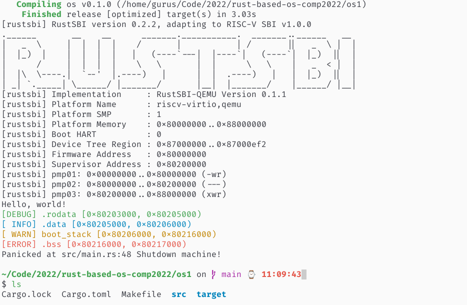

## 今日安排

+ 学习Rust基础知识，完成`rustlings`上的习题

## 完成情况

+ `rustlings`习题做到`error_handing`章节
+ 《rust语言圣经》看到2.11返回值和错误处理。因为并不是按顺序看的，而是根据习题走的，然后结合“The Rust Programming Language“进行巩固，所以第二章的基础入门大概完成。
+ 在windows的WSL2按照教程配置和运行环境，但是最后运行的时候会卡住。今天在linux物理机上重新走了一遍流程，成功运行。

# Appendix

[学习记录](../assets/record/rust_basic.md)

---

