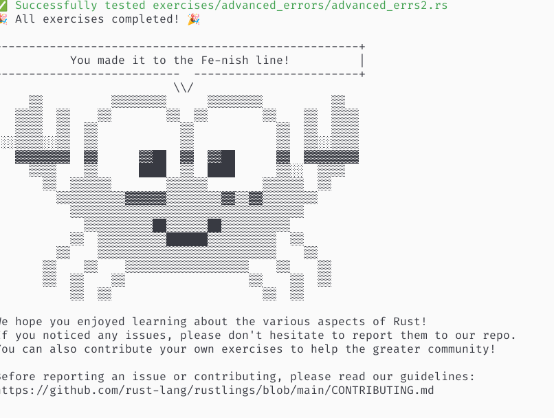

**写在前面**: 前几天因为个人的一些事情，暂停学习了几天，得加快学习进度。

## 今日安排

+ 学习Rust进阶知识
+ 继续做`rustlings`上的习题

## 完成情况

+ 完成`rustlings`的全部习题。
+ 《rust语言圣经》看完基础和进阶。接下来会通过实践对知识点进行巩固和补缺。

# Appendix

[学习记录](../assets/record/rust_basic.md)

